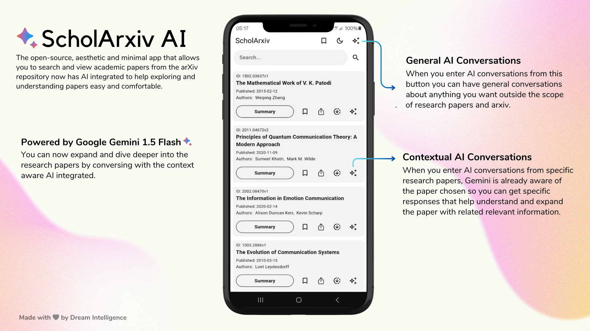
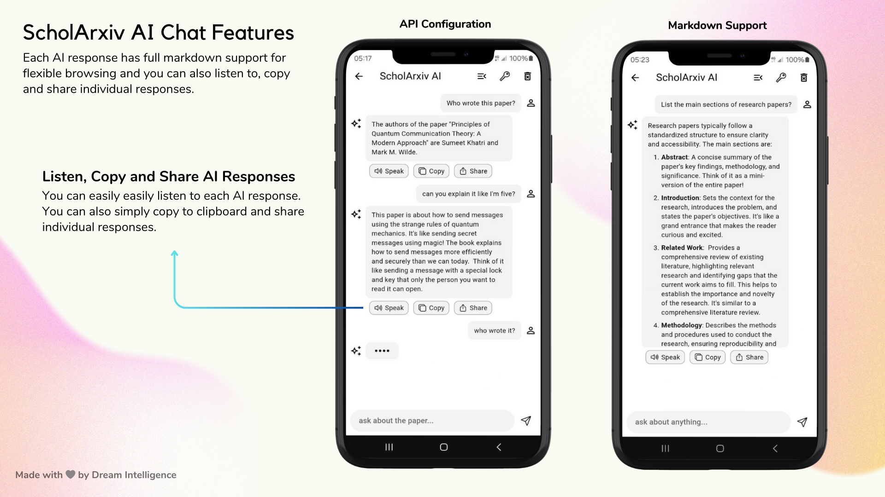
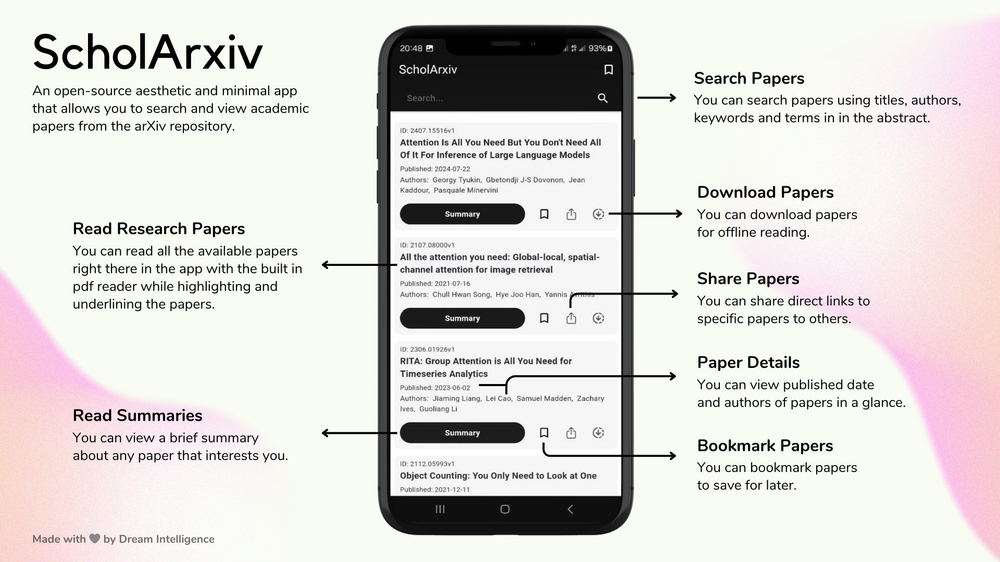
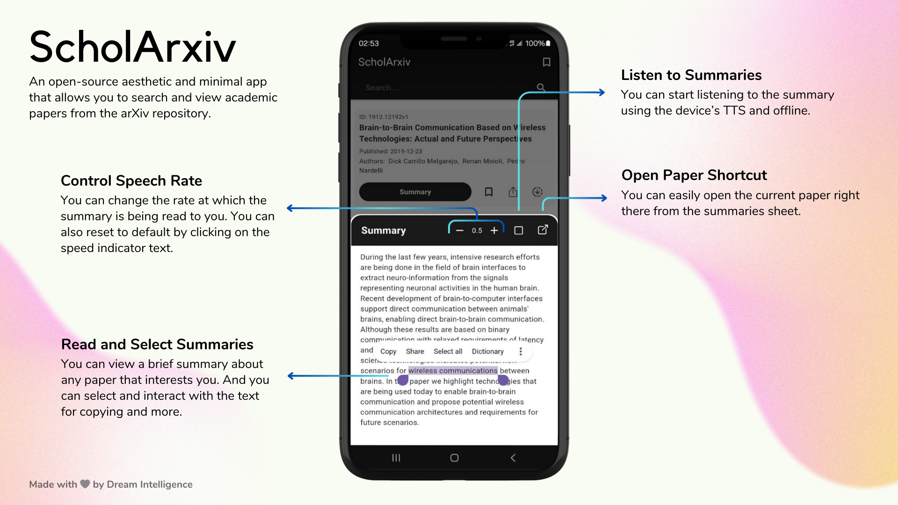
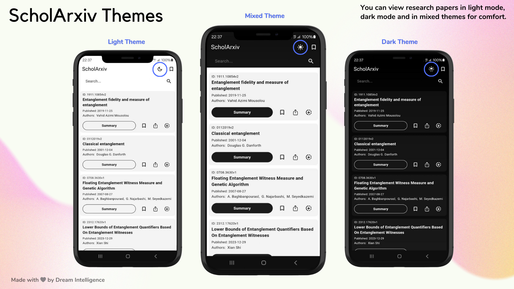

# ScholArxiv

**ScholArxiv** is an open-source aesthetic and minimal app that allows users to search, read, bookmark, share, download and view summaries of academic papers from the arXiv repository. Now you can configure your Gemini API key and converse with AI to expand and dive deeper into the papers you're exploring.

You can [download](https://github.com/dagmawibabi/ScholArxiv/releases/download/v3.0.0/ScholArxiv.apk) the latest version here. Enjoy!

### Features

📚 **Read Papers**: Read entire papers in detail within the app.

✨ **AI Chat**: You can chat with AI to delve deeper and understand papers.

🔖 **Bookmarks**: Save your favorite papers for quick access.

📝 **Summaries**: View and listen to brief paper summaries.

🔎 **Search Papers**: Search for papers using keywords, titles, authors and abstract. If no keyword is provided the app suggests random popular papers.

⬇️ **Download and Share Papers**: Download papers for offline reading or you can share document links to others.

☀️ **Themes**: There are three available themes to make browsing and discovering papers comfortable. Light mode, dark mode and mixed mode.

### Contribution

You can help support the project in three ways. ✨

1. By Contributing
    - Fork this repo
    - Add your new changes
    - Comment well
    - Open a PR
1. By Starring the Repo
1. By Sharing this Project to your friends and community

You can use the issues tab to get inspiration.

### More Illustrations

### License

This project is licensed under the GNU General Public License. You can make any contribution and distribute as long as your preleases are also open source - see the LICENSE file for details.

### Acknowledgements

Thank you to arXiv for the use of its open access interoperability.

---

_Made with 🤍 by Dream Intelligence_
